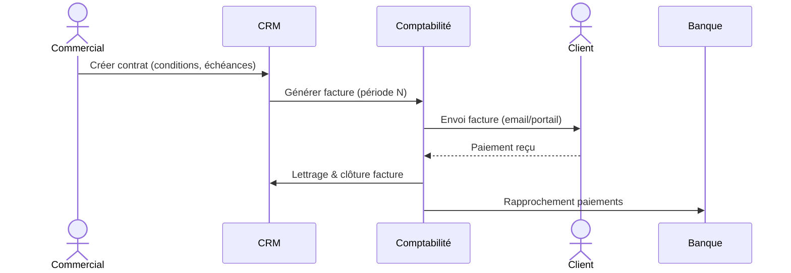

```mermaid
sequenceDiagram
  actor COM as Commercial
  participant CRM as CRM
  participant ACC as Comptabilité
  actor CLI as Client
  participant BANK as Banque

  COM ->> CRM: Créer contrat (conditions, échéances)
  CRM ->> ACC: Générer facture (période N)
  ACC ->> CLI: Envoi facture (email/portail)
  CLI -->> ACC: Paiement reçu
  ACC ->> CRM: Lettrage & clôture facture
  ACC ->> BANK: Rapprochement paiements

```