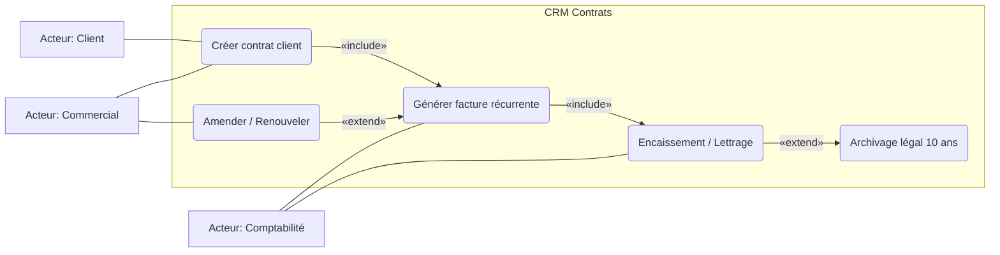

```mermaid
flowchart LR
    subgraph CRM[CRM Contrats]
        C1(Créer contrat client)
        C2(Amender / Renouveler)
        C3(Générer facture récurrente)
        C4(Encaissement / Lettrage)
        C5(Archivage légal 10 ans)
    end
    CL[Acteur: Client]
    COM[Acteur: Commercial]
    ACC[Acteur: Comptabilité]

    COM --- C1
    COM --- C2
    C1 -- «include» --> C3
    C2 -- «extend» --> C3
    C3 -- «include» --> C4
    C4 -- «extend» --> C5
    CL --- C1
    ACC --- C3
    ACC --- C4

```
