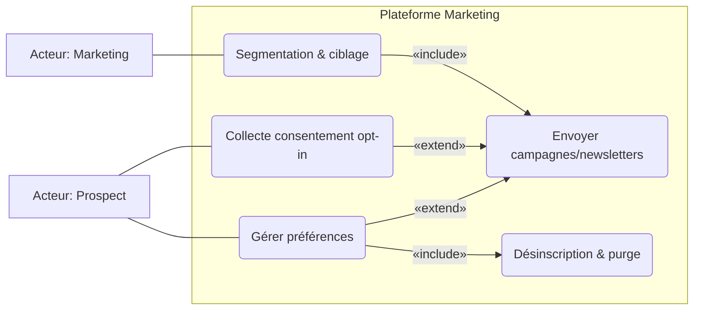
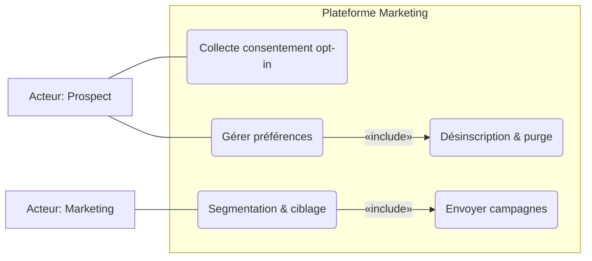

```mermaid
flowchart LR
  subgraph MKT[Plateforme Marketing]
    M1(Collecte consentement opt-in)
    M2(Gérer préférences)
    M3(Segmentation & ciblage)
    M4(Envoyer campagnes/newsletters)
    M5(Désinscription & purge)
  end
  PROS[Acteur: Prospect]
  MKT_TEAM[Acteur: Marketing]

  PROS --- M1
  PROS --- M2
  MKT_TEAM --- M3
  M3 -- «include» --> M4
  M2 -- «extend» --> M4
  M1 -- «extend» --> M4
  M2 -- «include» --> M5

```

ou

```mermaid
flowchart LR
subgraph MKT[Plateforme Marketing]
M1(Collecte consentement opt-in)
M2(Gérer préférences)
M3(Segmentation & ciblage)
M4(Envoyer campagnes)
M5(Désinscription & purge)
end
PROS[Acteur: Prospect]
TEAM[Acteur: Marketing]

PROS --- M1
PROS --- M2
TEAM --- M3
M3 -- «include» --> M4
M2 -- «include» --> M5
```
