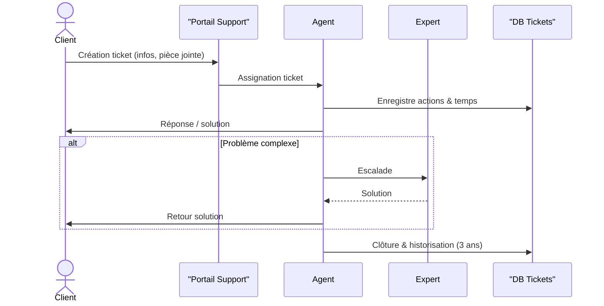

```mermaid
sequenceDiagram
    actor CLI as Client
    participant PS as "Portail Support"
    participant AG as Agent
    participant EXP as Expert
    participant DB as "DB Tickets"

    CLI ->> PS: Création ticket (infos, pièce jointe)
    PS ->> AG: Assignation ticket
    AG ->> DB: Enregistre actions & temps
    AG ->> CLI: Réponse / solution
    alt Problème complexe
        AG ->> EXP: Escalade
        EXP -->> AG: Solution
        AG ->> CLI: Retour solution
    end
    AG ->> DB: Clôture & historisation (3 ans)

```