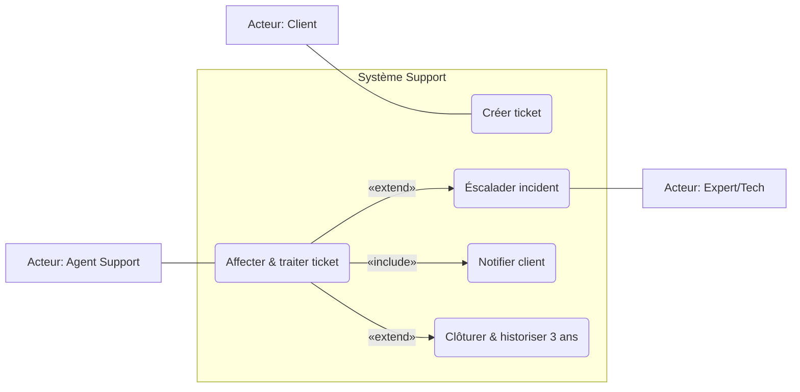

```mermaid
flowchart LR
  subgraph SUP[Système Support]
    S1(Créer ticket)
    S2(Affecter & traiter ticket)
    S3(Éscalader incident)
    S4(Notifier client)
    S5(Clôturer & historiser 3 ans)
  end
  CLI[Acteur: Client]
  AGT[Acteur: Agent Support]
  EXP[Acteur: Expert/Tech]

  CLI --- S1
  AGT --- S2
  S2 -- «extend» --> S3
  S2 -- «include» --> S4
  S2 -- «extend» --> S5
  S3 --- EXP

```