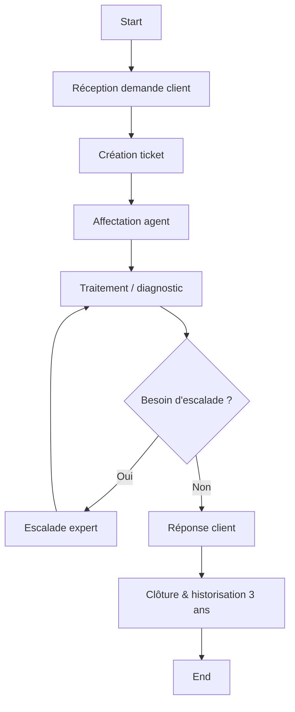

```mermaid
flowchart TD
    Start[Start]
    New[Réception demande client]
    Create[Création ticket]
    Assign[Affectation agent]
    Work[Traitement / diagnostic]
    IfEsc{Besoin d'escalade ?}
    Esc[Escalade expert]
    Respond[Réponse client]
    Close[Clôture & historisation 3 ans]
    End[End]

    Start --> New --> Create --> Assign --> Work --> IfEsc
    IfEsc -- Oui --> Esc --> Work
    IfEsc -- Non --> Respond
    Respond --> Close --> End

```