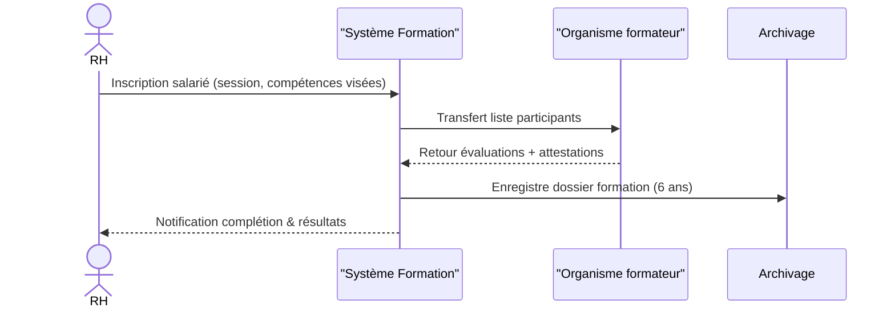

```mermaid
sequenceDiagram
  actor RH
  participant FORM as "Système Formation"
  participant OF as "Organisme formateur"
  participant ARCH as Archivage

  RH ->> FORM: Inscription salarié (session, compétences visées)
  FORM ->> OF: Transfert liste participants
  OF -->> FORM: Retour évaluations + attestations
  FORM ->> ARCH: Enregistre dossier formation (6 ans)
  FORM -->> RH: Notification complétion & résultats

```