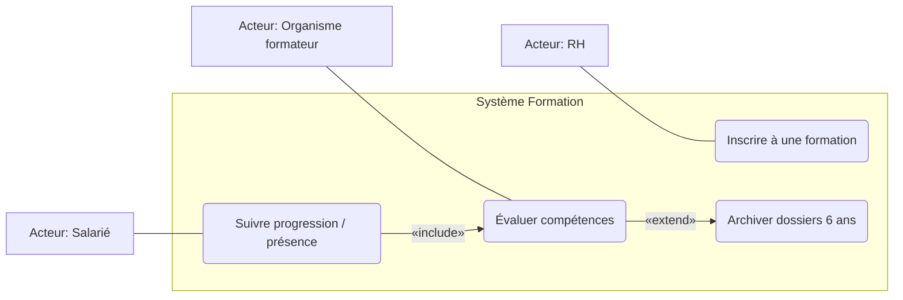

```mermaid
flowchart LR
    subgraph Form[Système Formation]
        F1(Inscrire à une formation)
        F2(Suivre progression / présence)
        F3(Évaluer compétences)
        F4(Archiver dossiers 6 ans)
    end
    SAL[Acteur: Salarié]
    RH[Acteur: RH]
    ORG[Acteur: Organisme formateur]

    RH --- F1
    SAL --- F2
    ORG --- F3
    F2 -- «include» --> F3
    F3 -- «extend» --> F4


```