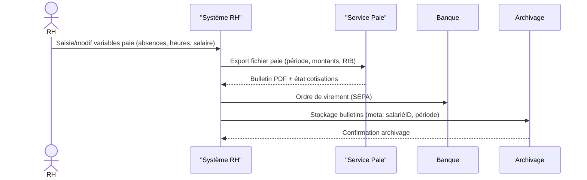

```mermaid
sequenceDiagram
    actor RH as RH
    participant SYS as "Système RH"
    participant PAY as "Service Paie"
    participant BANK as Banque
    participant ARCH as Archivage

    RH ->> SYS: Saisie/modif variables paie (absences, heures, salaire)
    SYS ->> PAY: Export fichier paie (période, montants, RIB)
    PAY -->> SYS: Bulletin PDF + état cotisations
    SYS ->> BANK: Ordre de virement (SEPA)
    SYS ->> ARCH: Stockage bulletins (meta: salariéID, période)
    ARCH -->> SYS: Confirmation archivage

```