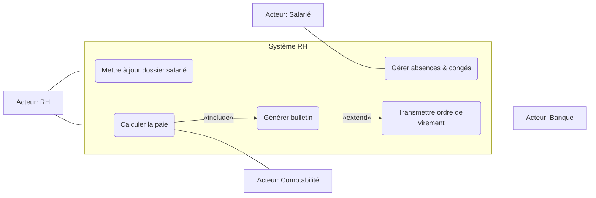

```mermaid
flowchart LR
  subgraph System[Système RH]
    UC1(Gérer absences & congés)
    UC2(Mettre à jour dossier salarié)
    UC3(Calculer la paie)
    UC4(Générer bulletin)
    UC5(Transmettre ordre de virement)
  end

  A[Acteur: Salarié]
  RH[Acteur: RH]
  COMPTA[Acteur: Comptabilité]
  BANQUE[Acteur: Banque]

  A --- UC1
  RH --- UC2
  RH --- UC3
  UC3 -- «include» --> UC4
  UC4 -- «extend» --> UC5
  UC3 --- COMPTA
  UC5 --- BANQUE
```