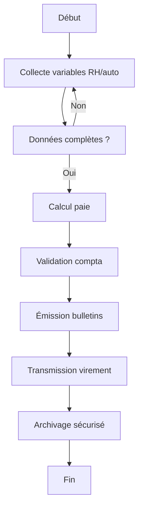

```mermaid
flowchart TD
    A[Début]
    B[Collecte variables RH/auto]
C[Données complètes ?]
D[Calcul paie]
E[Validation compta]
F[Émission bulletins]
G[Transmission virement]
H[Archivage sécurisé]
I[Fin]

A --> B --> C
C -- Oui --> D --> E
E --> F --> G --> H --> I
C -- Non --> B


```