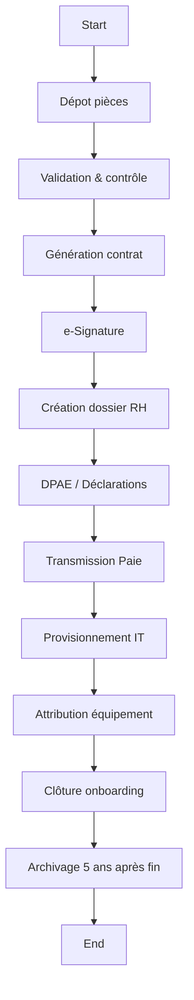

```mermaid
flowchart TD
  Start[Start]
  Deposit[Dépot pièces]
  Validate[Validation & contrôle]
  GenContract[Génération contrat]
  ESign[e-Signature]
  CreateHR[Création dossier RH]
  Decl[DPAE / Déclarations]
  ToPay[Transmission Paie]
  ProvisionIT[Provisionnement IT]
  Equip[Attribution équipement]
  Close[Clôture onboarding]
  Archive[Archivage 5 ans après fin]
  End[End]

  Start --> Deposit --> Validate
  Validate --> GenContract --> ESign
  ESign --> CreateHR --> Decl --> ToPay --> ProvisionIT --> Equip --> Close --> Archive --> End

```