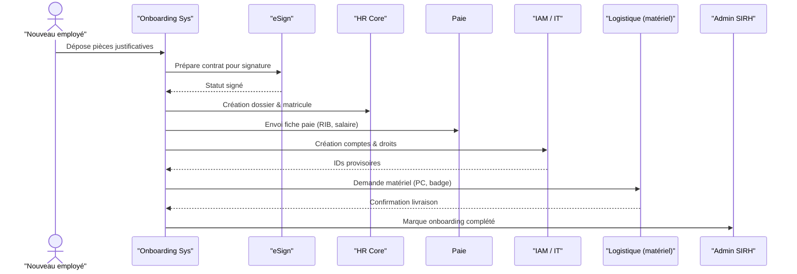

```mermaid
sequenceDiagram
  actor NEW as "Nouveau employé"
  participant ONB as "Onboarding Sys"
  participant ES as "eSign"
  participant HRC as "HR Core"
  participant PAY as Paie
  participant IAM as "IAM / IT"
  participant EQUIP as "Logistique (matériel)"
  participant ADMIN as "Admin SIRH"

  NEW ->> ONB: Dépose pièces justificatives
  ONB ->> ES: Prépare contrat pour signature
  ES -->> ONB: Statut signé
  ONB ->> HRC: Création dossier & matricule
  ONB ->> PAY: Envoi fiche paie (RIB, salaire)
  ONB ->> IAM: Création comptes & droits
  IAM -->> ONB: IDs provisoires
  ONB ->> EQUIP: Demande matériel (PC, badge)
  EQUIP -->> ONB: Confirmation livraison
  ONB ->> ADMIN: Marque onboarding complété

```