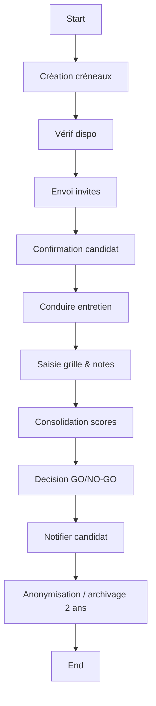

```mermaid
flowchart TD
  Start[Start]
  CreateSlots[Création créneaux]
  CheckAvail[Vérif dispo]
  Invite[Envoi invites]
  Confirm[Confirmation candidat]
  Conduct[Conduire entretien]
  Rate[Saisie grille & notes]
  Consolidate[Consolidation scores]
  Decide[Decision GO/NO-GO]
  Notify[Notifier candidat]
  Archive[Anonymisation / archivage 2 ans]
  End[End]

  Start --> CreateSlots --> CheckAvail --> Invite --> Confirm --> Conduct --> Rate --> Consolidate --> Decide --> Notify --> Archive --> End

```