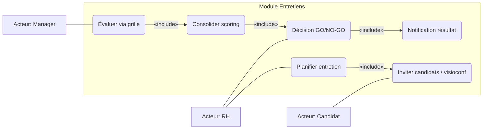

```mermaid
flowchart LR
    subgraph INT[Module Entretiens]
        E1(Planifier entretien)
        E2(Inviter candidats / visioconf)
        E3(Évaluer via grille)
        E4(Consolider scoring)
        E5(Décision GO/NO-GO)
        E6(Notification résultat)
    end
    RH[Acteur: RH]
    MGR[Acteur: Manager]
    C[Acteur: Candidat]

    RH --- E1
    E1 -- «include» --> E2
    MGR --- E3
    E3 -- «include» --> E4
    RH --- E5
    E4 -- «include» --> E5
    E5 -- «include» --> E6
    C --- E2

```