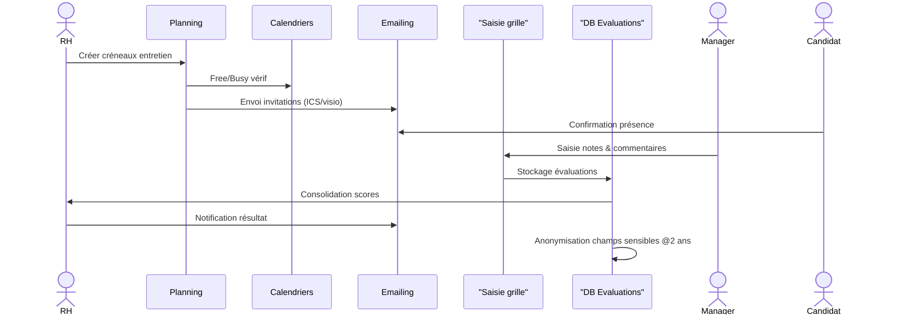

```mermaid
sequenceDiagram
  actor RH
  participant PLAN as Planning
  participant CAL as Calendriers
  participant MAIL as Emailing
  participant GRID as "Saisie grille"
  participant DB as "DB Evaluations"
  actor MGR as Manager
  actor C as Candidat

  RH ->> PLAN: Créer créneaux entretien
  PLAN ->> CAL: Free/Busy vérif
  PLAN ->> MAIL: Envoi invitations (ICS/visio)
  C ->> MAIL: Confirmation présence
  MGR ->> GRID: Saisie notes & commentaires
  GRID ->> DB: Stockage évaluations
  DB ->> RH: Consolidation scores
  RH ->> MAIL: Notification résultat
  DB ->> DB: Anonymisation champs sensibles @2 ans

```