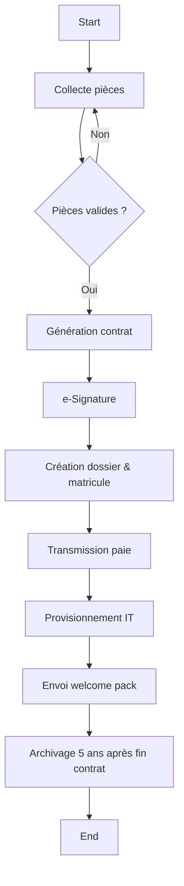

```mermaid
flowchart TD
  Start[Start]
  Collect[Collecte pièces]
  Check{Pièces valides ?}
  GenCont[Génération contrat]
  ESign[e-Signature]
  CreateHR[Création dossier & matricule]
  ToPaie[Transmission paie]
  CreateIT[Provisionnement IT]
  Welcome[Envoi welcome pack]
  Archive[Archivage 5 ans après fin contrat]
  End[End]

  Start --> Collect --> Check
  Check -- Non --> Collect
  Check -- Oui --> GenCont --> ESign
  ESign --> CreateHR --> ToPaie --> CreateIT --> Welcome --> Archive --> End

```