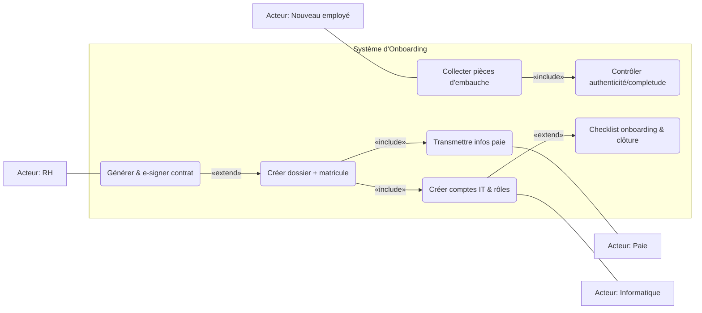

```mermaid
flowchart LR
  subgraph OB[Système d'Onboarding]
    O1(Collecter pièces d'embauche)
    O2(Contrôler authenticité/completude)
    O3(Générer & e-signer contrat)
    O4(Créer dossier + matricule)
    O5(Transmettre infos paie)
    O6(Créer comptes IT & rôles)
    O7(Checklist onboarding & clôture)
  end
  NEW[Acteur: Nouveau employé]
  RH[Acteur: RH]
  PAIE[Acteur: Paie]
  IT[Acteur: Informatique]

  NEW --- O1
  O1 -- «include» --> O2
  RH --- O3
  O3 -- «extend» --> O4
  O4 -- «include» --> O5
  O4 -- «include» --> O6
  O6 -- «extend» --> O7
  O5 --- PAIE
  O6 --- IT
```