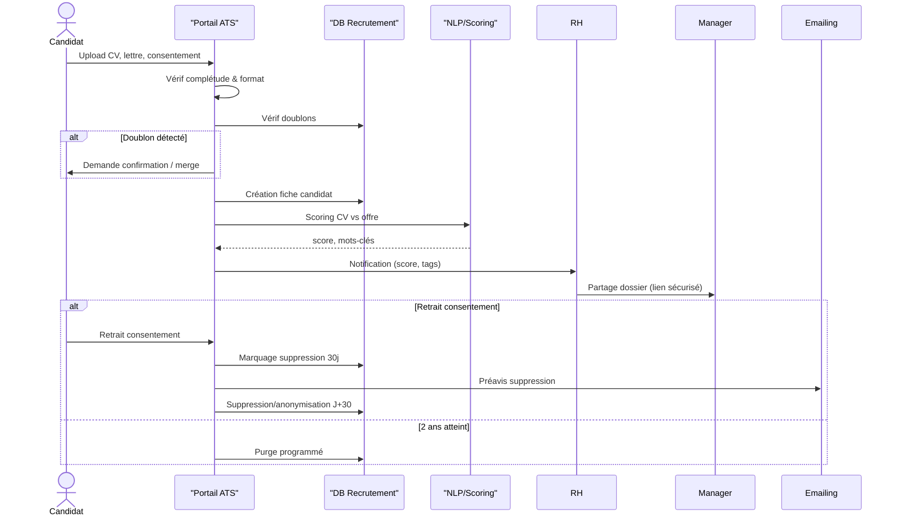

```mermaid
sequenceDiagram
  actor C as Candidat
  participant ATS as "Portail ATS"
  participant DB as "DB Recrutement"
  participant NLP as "NLP/Scoring"
  participant RH as RH
  participant MGR as Manager
  participant MAIL as Emailing

  C ->> ATS: Upload CV, lettre, consentement
  ATS ->> ATS: Vérif complétude & format
  ATS ->> DB: Vérif doublons
  alt Doublon détecté
    ATS ->> C: Demande confirmation / merge
  end
  ATS ->> DB: Création fiche candidat
  ATS ->> NLP: Scoring CV vs offre
  NLP -->> ATS: score, mots-clés
  ATS ->> RH: Notification (score, tags)
  RH ->> MGR: Partage dossier (lien sécurisé)
  alt Retrait consentement
    C ->> ATS: Retrait consentement
    ATS ->> DB: Marquage suppression 30j
    ATS ->> MAIL: Préavis suppression
    ATS ->> DB: Suppression/anonymisation J+30
  else 2 ans atteint
    ATS ->> DB: Purge programmé
  end

```