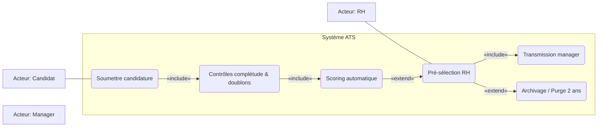

```mermaid
flowchart LR
    subgraph ATS[Système ATS]
        R1(Soumettre candidature)
        R2(Contrôles complétude & doublons)
        R3(Scoring automatique)
        R4(Pré-sélection RH)
        R5(Transmission manager)
        R6(Archivage / Purge 2 ans)
    end
    CAND[Acteur: Candidat]
    RH[Acteur: RH]
    MGR[Acteur: Manager]

    CAND --- R1
    R1 -- «include» --> R2
    R2 -- «include» --> R3
    RH --- R4
    R3 -- «extend» --> R4
    R4 -- «include» --> R5
    R4 -- «extend» --> R6

```